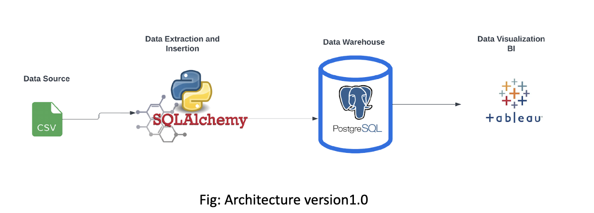
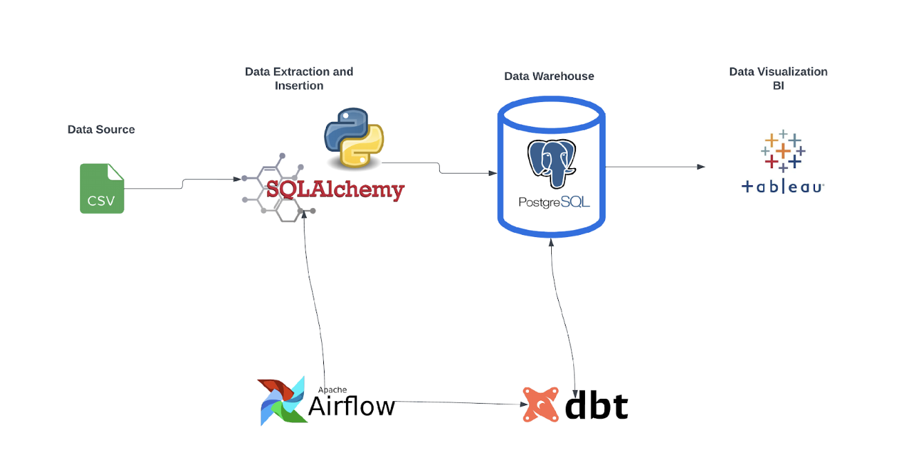

DataWarehousingFoodDataEngineering

# Introduction

We intend to implement a data engineering solution for the City of Chicago food inspection committee to help them make data-driven decisions for better and more efficient operations.

The data is acquired from the “Chicago Data Portal- Health and Human Services” which contains inspection of restaurants and different food establishments in Chicago from 2010 to 2023. The database is continuously updated as inspections continue.

### Data Source

The data is extracted in form of a CSV file, and it contains various 17 columns/attributes. The details of which can be found in the link attached below.

[https://data.cityofchicago.org/Health-Human-Services/Food-Inspections/4ijn-s7e5](https://data.cityofchicago.org/Health-Human-Services/Food-Inspections/4ijn-s7e5)

| Column Name     | Description                                      | Type        |     |
| --------------- | ------------------------------------------------ | ----------- | --- |
| Inspection ID   | Unique ID for each inspection done               | Numeric     |     |
| DBA Name        | Doing Business As: Name of food establishment    | Text        |     |
| AKA Name        | Also Known As: Public name of food establishment | Text        |     |
| License #       | License Number of food establishment             | Numeric     |     |
| Facility Type   | Type of facility: grocery, restaurant, etc.      | Text        |     |
| Risk            | Various Risk level                               | Text        |     |
| Address         | Address of restaurants                           | Text        |     |
| City            | City Name                                        | Text        |     |
| State           | State Name                                       | Text        |     |
| Zip Code        | Zip Code                                         | Numeric     |     |
| Inspection Date | Date of Inspection                               | Date & Time |     |
| Inspection Type | Various types of Inspection                      | Text        |     |
| Result          | Verdict of inspection                            | Text        |     |
| Violation       | Violation details                                | Text        |     |
| Latitude        | Geo Latitude                                     | Numeric     |     |
| Longitude       | Geo Longitude                                    | Numeric     |     |
| Location        | Combination of latitude and longitude.           | Numeric     |     |

| Meta Data   | Values |
| ----------- | ------ |
| Rows        | 252K   |
| Columns     | 17     |
| Updated     | Daily  |
| Data Format | CSV    |

# Architecture

